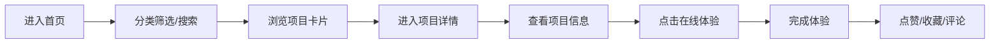
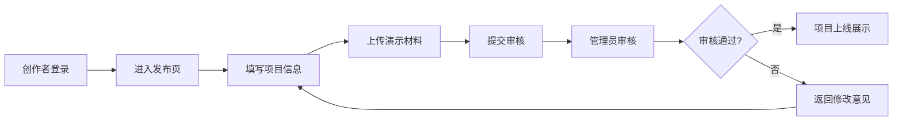
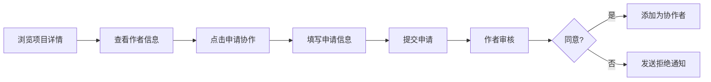

## 1. 产品概述

AI 项目广场是一个供开发者、学生和创业团队展示可体验 AI 小项目的 Web 平台。用户可以浏览、体验、收藏和互动各类 AI 项目，创作者可以发布自己的作品并获得反馈，平台方负责内容审核和运营。

- 核心价值：降低 AI 项目展示和体验门槛，促进技术交流与协作
- 目标用户：开发者、学生、创业团队、AI 技术爱好者
- 解决的问题：AI 项目分散难以发现、缺乏统一展示平台、创作者缺少反馈渠道

## 2. 核心功能

### 2.1 用户角色

| 角色 | 注册方式 | 核心权限 |
|------|---------|---------|
| 普通用户 | 邮箱/手机号注册 | 浏览项目、体验项目、收藏点赞评论、提交反馈、申请协作 |
| 创作者 | 邮箱/手机号注册并认证 | 发布项目、管理项目、查看统计、管理协作者 |
| 审核管理员 | 后台账号 | 内容审核、设置精选、标记失效链接、管理专题、查看数据统计 |

### 2.2 功能模块

1. **项目流首页**：分类导航、精选专题、热度排行、项目卡片流、搜索筛选
2. **项目详情页**：项目介绍、演示截图、在线体验入口、使用限制、更新日志、作者信息、互动区（点赞/收藏/评论/反馈/协作申请）
3. **作者主页**：作者简介、项目列表、成就统计、联系方式、粉丝关注
4. **提交发布页**：项目信息填写、演示材料上传、分类标签设置、体验链接配置
5. **审核后台**：待审核列表、内容审核操作、精选专题管理、失效链接管理、热度排行管理

### 2.3 页面详情

| 页面名称 | 模块名称 | 功能描述 |
|---------|---------|---------|
| 项目流首页 | 顶部导航 | Logo、搜索框、分类菜单、登录/注册、发布按钮、个人中心入口 |
| 项目流首页 | 精选专题区 | 轮播展示精选专题，支持点击进入专题详情 |
| 项目流首页 | 分类筛选栏 | 文本、图像、办公、学习、娱乐等分类标签，支持多选筛选 |
| 项目流首页 | 热度排行榜 | 按点赞/收藏/浏览量排序的项目榜单 |
| 项目流首页 | 项目卡片流 | 无限滚动加载的项目卡片，展示封面、标题、作者、分类、热度数据 |
| 项目详情页 | 项目头部 | 封面图、标题、分类标签、作者信息、热度数据、操作按钮（点赞/收藏/分享） |
| 项目详情页 | 项目介绍 | 项目说明、功能特点、技术栈说明 |
| 项目详情页 | 演示截图 | 多图轮播展示项目截图 |
| 项目详情页 | 在线体验 | 立即体验按钮，支持内嵌 iframe 或跳转链接 |
| 项目详情页 | 使用限制 | 免费/付费说明、调用次数限制、使用须知 |
| 项目详情页 | 更新日志 | 版本历史更新记录 |
| 项目详情页 | 作者信息 | 作者头像、简介、其他项目、联系方式 |
| 项目详情页 | 互动区 | 评论列表、评论输入、反馈提交、协作申请入口 |
| 作者主页 | 作者信息区 | 头像、昵称、简介、粉丝数、关注数、成就徽章 |
| 作者主页 | 项目列表 | 作者发布的所有项目卡片列表 |
| 作者主页 | 统计数据 | 总浏览量、总点赞、总收藏、项目数量 |
| 提交发布页 | 基础信息 | 项目名称、分类、标签、封面图上传 |
| 提交发布页 | 详细描述 | 项目介绍、功能特点、使用说明 |
| 提交发布页 | 演示材料 | 截图上传、演示视频链接、在线体验地址配置 |
| 提交发布页 | 附加信息 | 使用限制、更新日志、技术栈、开源协议 |
| 审核后台 | 数据概览 | 今日新增、待审核数量、总项目数、用户统计 |
| 审核后台 | 审核列表 | 待审核/已通过/已拒绝项目列表，支持搜索筛选 |
| 审核后台 | 审核操作 | 查看详情、通过/拒绝、添加审核意见 |
| 审核后台 | 专题管理 | 创建/编辑/删除精选专题、添加项目到专题 |
| 审核后台 | 链接管理 | 标记失效链接、批量检查链接状态 |
| 审核后台 | 热度管理 | 查看热度排行、手动调整热度权重 |

## 3. 核心流程

### 3.1 用户浏览体验流程

用户进入首页 → 选择分类或搜索 → 浏览项目卡片 → 点击进入详情 → 查看项目信息 → 点击在线体验 → 体验完成后点赞/收藏/评论

### 3.2 项目发布审核流程

创作者登录 → 进入发布页 → 填写项目信息 → 上传演示材料 → 提交审核 → 管理员审核 → 审核通过后展示 → 项目上线

### 3.3 协作申请流程

用户浏览项目 → 查看作者信息 → 点击申请协作 → 填写申请信息 → 提交申请 → 作者审核 → 同意/拒绝

## 4. 用户界面设计

### 4.1 设计风格

**设计理念：科技感与简约的平衡，突出内容本身**

- **主色调**：深空蓝 `#0F172A` 作为背景主色，营造科技沉浸感
- **强调色**：霓虹青 `#22D3EE` 用于按钮和交互元素，电光紫 `#A855F7` 用于强调和渐变
- **辅助色**：翡翠绿 `#10B981` 表示成功/通过，珊瑚红 `#F43F5E` 表示错误/警告
- **字体**：
  - 标题：Space Grotesk，几何感无衬线字体，突出科技感
  - 正文：Inter，清晰易读的现代无衬线字体
- **布局风格**：卡片式布局，层叠阴影，悬浮动效
- **图标**：线性图标（lucide-react），统一 24px 尺寸
- **动效**：悬停微交互、平滑过渡、渐入渐出动画

### 4.2 页面设计概述

| 页面名称 | 模块名称 | UI 元素 |
|---------|---------|---------|
| 项目流首页 | 顶部导航 | 深色背景、霓虹青 Logo、发光搜索框、悬浮下拉菜单 |
| 项目流首页 | 精选专题区 | 大幅渐变背景、轮播卡片、霓虹边框、悬停放大效果 |
| 项目流首页 | 分类筛选栏 | 胶囊形标签、选中态发光效果、横向滚动 |
| 项目流首页 | 热度排行榜 | 玻璃拟态侧边栏、排名序号徽章、数据条形图 |
| 项目流首页 | 项目卡片流 | 响应式网格、卡片悬浮抬起、封面图渐变叠加、数据角标 |
| 项目详情页 | 项目头部 | 大幅封面、渐变遮罩、作者头像悬浮、操作按钮组 |
| 项目详情页 | 内容区 | 双栏布局（主内容+侧边栏）、章节分隔线、代码块高亮 |
| 项目详情页 | 演示截图 | 轮播组件、缩略图导航、点击放大预览 |
| 项目详情页 | 在线体验 | CTA 大按钮、发光边框、倒计时动效 |
| 项目详情页 | 互动区 | 评论卡片、输入框聚焦动画、表情选择器 |
| 审核后台 | 数据概览 | 统计卡片、数据大屏风格、数字滚动动画 |
| 审核后台 | 审核列表 | 表格布局、状态标签、操作按钮组 |

### 4.3 响应式设计

- **桌面端**（≥1280px）：4列项目卡片网格、侧边栏展示热度榜、双栏详情页
- **平板端**（768px-1279px）：2列项目卡片网格、热度榜折叠为顶部轮播、单栏详情页
- **移动端**（<768px）：1列项目卡片、底部导航栏、分类横向滚动、内容自适应全屏

### 4.4 交互细节

- **悬停效果**：卡片抬起 + 阴影加深 + 边框发光
- **点击反馈**：按钮缩放 0.95 + 颜色加深
- **加载状态**：骨架屏占位 + 脉冲动画
- **滚动效果**：导航栏背景渐变、返回顶部按钮、无限滚动加载更多
- **表单交互**：输入框聚焦发光、错误状态抖动、成功状态绿色对勾
