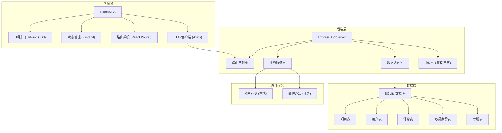
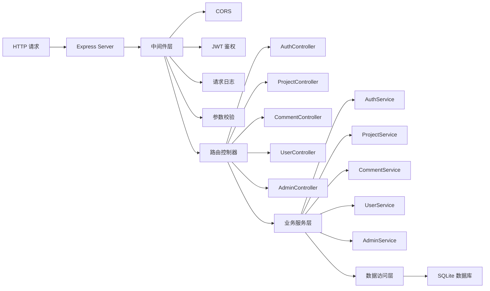
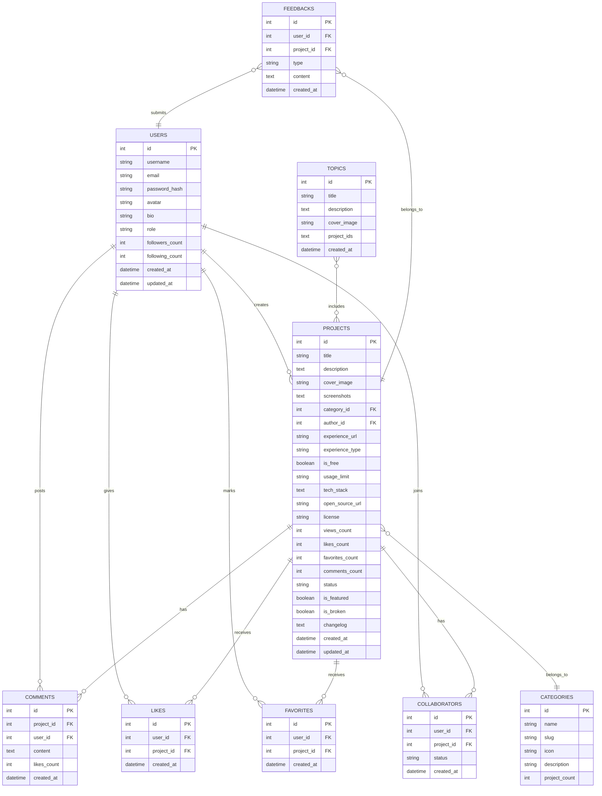

## 1. 架构设计



## 2. 技术描述

- **前端框架**: React 18 + TypeScript 5
- **构建工具**: Vite 5
- **样式方案**: Tailwind CSS 3.4
- **状态管理**: Zustand 4
- **路由管理**: React Router DOM 6
- **HTTP 客户端**: Axios 1.6
- **图标库**: Lucide React
- **后端框架**: Express 4 + TypeScript
- **数据库**: SQLite 3 + better-sqlite3
- **ORM**: 原生 SQL + 参数化查询
- **认证方案**: JWT (jsonwebtoken)
- **密码加密**: bcryptjs
- **文件上传**: Multer
- **初始化工具**: vite-init react-express-ts 模板

## 3. 路由定义

### 3.1 前端路由

| 路由路径 | 页面组件 | 权限要求 | 功能描述 |
|---------|---------|---------|---------|
| `/` | HomePage | 公开 | 项目流首页，分类筛选、热度排行、精选专题 |
| `/project/:id` | ProjectDetailPage | 公开 | 项目详情页，包含在线体验入口 |
| `/author/:id` | AuthorPage | 公开 | 作者主页，展示作者信息和项目列表 |
| `/publish` | PublishPage | 登录用户 | 项目提交发布页 |
| `/profile` | ProfilePage | 登录用户 | 个人中心，管理发布的项目 |
| `/collections` | CollectionsPage | 登录用户 | 我的收藏 |
| `/admin` | AdminDashboard | 管理员 | 审核后台首页 |
| `/admin/review` | AdminReviewPage | 管理员 | 内容审核列表 |
| `/admin/topics` | AdminTopicsPage | 管理员 | 精选专题管理 |
| `/admin/links` | AdminLinksPage | 管理员 | 失效链接管理 |
| `/login` | LoginPage | 公开 | 用户登录 |
| `/register` | RegisterPage | 公开 | 用户注册 |
| `*` | NotFoundPage | 公开 | 404 页面 |

### 3.2 后端 API 路由

| 方法 | 路由路径 | 权限 | 功能描述 |
|-----|---------|-----|---------|
| POST | `/api/auth/register` | 公开 | 用户注册 |
| POST | `/api/auth/login` | 公开 | 用户登录 |
| GET | `/api/auth/me` | 登录 | 获取当前用户信息 |
| GET | `/api/projects` | 公开 | 获取项目列表（支持筛选、分页、排序） |
| GET | `/api/projects/:id` | 公开 | 获取项目详情 |
| POST | `/api/projects` | 登录 | 提交新项目（待审核） |
| PUT | `/api/projects/:id` | 登录（作者） | 更新项目信息 |
| DELETE | `/api/projects/:id` | 登录（作者/管理员） | 删除项目 |
| POST | `/api/projects/:id/like` | 登录 | 点赞/取消点赞 |
| POST | `/api/projects/:id/favorite` | 登录 | 收藏/取消收藏 |
| GET | `/api/projects/:id/comments` | 公开 | 获取项目评论列表 |
| POST | `/api/projects/:id/comments` | 登录 | 发表评论 |
| POST | `/api/projects/:id/feedback` | 登录 | 提交反馈 |
| POST | `/api/projects/:id/collab` | 登录 | 申请协作 |
| GET | `/api/projects/hot` | 公开 | 获取热度排行榜 |
| GET | `/api/categories` | 公开 | 获取分类列表 |
| GET | `/api/topics` | 公开 | 获取精选专题列表 |
| GET | `/api/topics/:id` | 公开 | 获取专题详情 |
| GET | `/api/users/:id` | 公开 | 获取用户信息 |
| GET | `/api/users/:id/projects` | 公开 | 获取用户发布的项目 |
| GET | `/api/users/favorites` | 登录 | 获取我的收藏列表 |
| GET | `/api/admin/projects/pending` | 管理员 | 获取待审核项目列表 |
| PUT | `/api/admin/projects/:id/approve` | 管理员 | 审核通过项目 |
| PUT | `/api/admin/projects/:id/reject` | 管理员 | 审核拒绝项目 |
| POST | `/api/admin/topics` | 管理员 | 创建精选专题 |
| PUT | `/api/admin/topics/:id` | 管理员 | 更新专题 |
| DELETE | `/api/admin/topics/:id` | 管理员 | 删除专题 |
| PUT | `/api/admin/projects/:id/mark-broken` | 管理员 | 标记失效链接 |
| GET | `/api/admin/stats` | 管理员 | 获取平台统计数据 |

## 4. API 数据类型定义

```typescript
// shared/types/index.ts

export interface User {
  id: number;
  username: string;
  email: string;
  avatar: string;
  bio: string;
  role: 'user' | 'creator' | 'admin';
  followersCount: number;
  followingCount: number;
  createdAt: string;
}

export interface Category {
  id: number;
  name: string;
  slug: string;
  icon: string;
  description: string;
  projectCount: number;
}

export interface Project {
  id: number;
  title: string;
  description: string;
  coverImage: string;
  screenshots: string[];
  categoryId: number;
  category: Category;
  tags: string[];
  authorId: number;
  author: User;
  collaborators: User[];
  experienceUrl: string;
  experienceType: 'iframe' | 'external';
  isFree: boolean;
  usageLimit: string;
  techStack: string[];
  openSourceUrl: string;
  license: string;
  viewsCount: number;
  likesCount: number;
  favoritesCount: number;
  commentsCount: number;
  status: 'pending' | 'approved' | 'rejected';
  isFeatured: boolean;
  isBroken: boolean;
  changelog: ChangelogEntry[];
  createdAt: string;
  updatedAt: string;
  isLiked?: boolean;
  isFavorited?: boolean;
}

export interface ChangelogEntry {
  version: string;
  date: string;
  description: string;
}

export interface Comment {
  id: number;
  projectId: number;
  userId: number;
  user: User;
  content: string;
  createdAt: string;
  likesCount: number;
}

export interface Topic {
  id: number;
  title: string;
  description: string;
  coverImage: string;
  projectIds: number[];
  projects: Project[];
  createdAt: string;
}

export interface ApiResponse<T = any> {
  code: number;
  message: string;
  data: T;
}

export interface PaginatedResponse<T> {
  items: T[];
  total: number;
  page: number;
  pageSize: number;
  hasMore: boolean;
}
```

## 5. 服务器架构



## 6. 数据模型

### 6.1 ER 图



### 6.2 DDL 语句

```sql
-- 用户表
CREATE TABLE users (
  id INTEGER PRIMARY KEY AUTOINCREMENT,
  username VARCHAR(50) UNIQUE NOT NULL,
  email VARCHAR(100) UNIQUE NOT NULL,
  password_hash VARCHAR(255) NOT NULL,
  avatar VARCHAR(255),
  bio TEXT,
  role VARCHAR(20) DEFAULT 'user',
  followers_count INTEGER DEFAULT 0,
  following_count INTEGER DEFAULT 0,
  created_at DATETIME DEFAULT CURRENT_TIMESTAMP,
  updated_at DATETIME DEFAULT CURRENT_TIMESTAMP
);

-- 分类表
CREATE TABLE categories (
  id INTEGER PRIMARY KEY AUTOINCREMENT,
  name VARCHAR(50) NOT NULL,
  slug VARCHAR(50) UNIQUE NOT NULL,
  icon VARCHAR(50),
  description TEXT,
  project_count INTEGER DEFAULT 0
);

-- 项目表
CREATE TABLE projects (
  id INTEGER PRIMARY KEY AUTOINCREMENT,
  title VARCHAR(200) NOT NULL,
  description TEXT NOT NULL,
  cover_image VARCHAR(255),
  screenshots TEXT,
  category_id INTEGER REFERENCES categories(id),
  author_id INTEGER REFERENCES users(id),
  experience_url VARCHAR(500),
  experience_type VARCHAR(20) DEFAULT 'external',
  is_free BOOLEAN DEFAULT 1,
  usage_limit TEXT,
  tech_stack TEXT,
  open_source_url VARCHAR(500),
  license VARCHAR(100),
  views_count INTEGER DEFAULT 0,
  likes_count INTEGER DEFAULT 0,
  favorites_count INTEGER DEFAULT 0,
  comments_count INTEGER DEFAULT 0,
  status VARCHAR(20) DEFAULT 'pending',
  is_featured BOOLEAN DEFAULT 0,
  is_broken BOOLEAN DEFAULT 0,
  changelog TEXT,
  created_at DATETIME DEFAULT CURRENT_TIMESTAMP,
  updated_at DATETIME DEFAULT CURRENT_TIMESTAMP
);

-- 评论表
CREATE TABLE comments (
  id INTEGER PRIMARY KEY AUTOINCREMENT,
  project_id INTEGER REFERENCES projects(id),
  user_id INTEGER REFERENCES users(id),
  content TEXT NOT NULL,
  likes_count INTEGER DEFAULT 0,
  created_at DATETIME DEFAULT CURRENT_TIMESTAMP
);

-- 点赞表
CREATE TABLE likes (
  id INTEGER PRIMARY KEY AUTOINCREMENT,
  user_id INTEGER REFERENCES users(id),
  project_id INTEGER REFERENCES projects(id),
  created_at DATETIME DEFAULT CURRENT_TIMESTAMP,
  UNIQUE(user_id, project_id)
);

-- 收藏表
CREATE TABLE favorites (
  id INTEGER PRIMARY KEY AUTOINCREMENT,
  user_id INTEGER REFERENCES users(id),
  project_id INTEGER REFERENCES projects(id),
  created_at DATETIME DEFAULT CURRENT_TIMESTAMP,
  UNIQUE(user_id, project_id)
);

-- 协作者表
CREATE TABLE collaborators (
  id INTEGER PRIMARY KEY AUTOINCREMENT,
  user_id INTEGER REFERENCES users(id),
  project_id INTEGER REFERENCES projects(id),
  status VARCHAR(20) DEFAULT 'pending',
  created_at DATETIME DEFAULT CURRENT_TIMESTAMP,
  UNIQUE(user_id, project_id)
);

-- 专题表
CREATE TABLE topics (
  id INTEGER PRIMARY KEY AUTOINCREMENT,
  title VARCHAR(200) NOT NULL,
  description TEXT,
  cover_image VARCHAR(255),
  project_ids TEXT,
  created_at DATETIME DEFAULT CURRENT_TIMESTAMP
);

-- 反馈表
CREATE TABLE feedbacks (
  id INTEGER PRIMARY KEY AUTOINCREMENT,
  user_id INTEGER REFERENCES users(id),
  project_id INTEGER REFERENCES projects(id),
  type VARCHAR(50),
  content TEXT NOT NULL,
  created_at DATETIME DEFAULT CURRENT_TIMESTAMP
);

-- 索引
CREATE INDEX idx_projects_status ON projects(status);
CREATE INDEX idx_projects_category ON projects(category_id);
CREATE INDEX idx_projects_author ON projects(author_id);
CREATE INDEX idx_comments_project ON comments(project_id);
CREATE INDEX idx_likes_project ON likes(project_id);
CREATE INDEX idx_favorites_user ON favorites(user_id);
```

### 6.3 初始数据

```sql
-- 插入分类
INSERT INTO categories (name, slug, icon, description) VALUES
('文本生成', 'text', 'file-text', 'AI 写作、对话、翻译、摘要等文本类应用'),
('图像处理', 'image', 'image', 'AI 画图、修图、风格转换、图像识别等'),
('办公效率', 'office', 'briefcase', 'AI 办公助手、文档处理、数据分析等'),
('学习教育', 'learning', 'graduation-cap', 'AI 学习工具、智能教育、知识问答等'),
('娱乐休闲', 'entertainment', 'gamepad-2', 'AI 游戏、音乐、视频、趣味应用等');

-- 插入管理员账号 (密码: admin123)
INSERT INTO users (username, email, password_hash, role, bio) VALUES
('admin', 'admin@aiplaza.com', '$2a$10$rqH3K7xqz8y9z0x1y2z3w4v5u4t3s2r1q0p9o8n7m6l5k4j3h2g1f', 'admin', '平台管理员');

-- 插入测试用户 (密码: user123)
INSERT INTO users (username, email, password_hash, role, bio) VALUES
('creator01', 'creator@example.com', '$2a$10$rqH3K7xqz8y9z0x1y2z3w4v5u4t3s2r1q0p9o8n7m6l5k4j3h2g1f', 'creator', 'AI 爱好者，专注于前端开发和机器学习应用'),
('user01', 'user@example.com', '$2a$10$rqH3K7xqz8y9z0x1y2z3w4v5u4t3s2r1q0p9o8n7m6l5k4j3h2g1f', 'user', '普通用户，喜欢体验各种 AI 应用');
```
